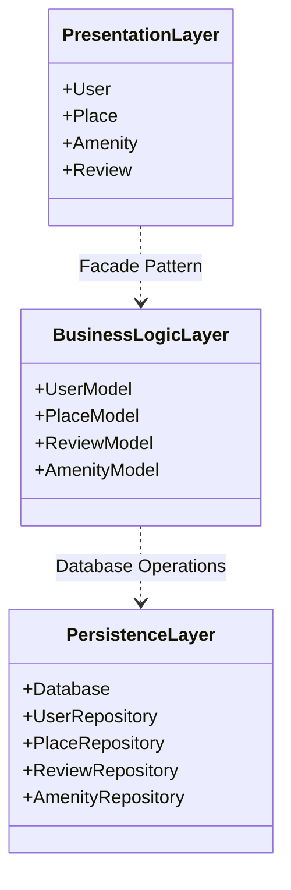
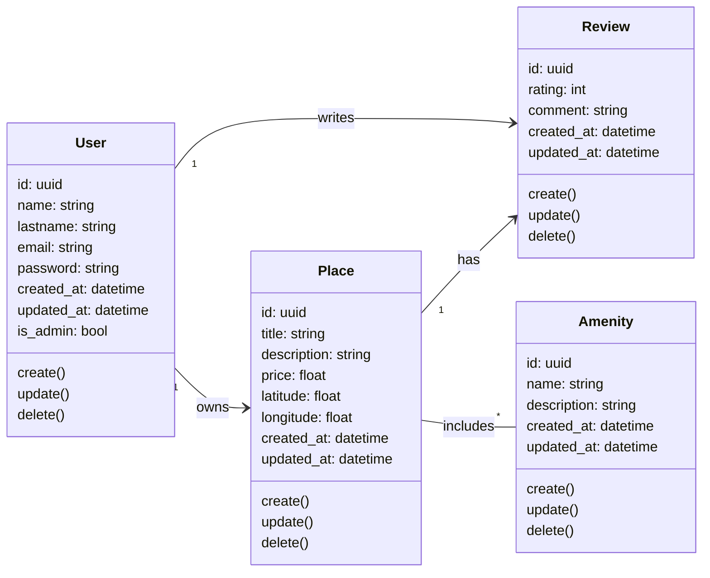
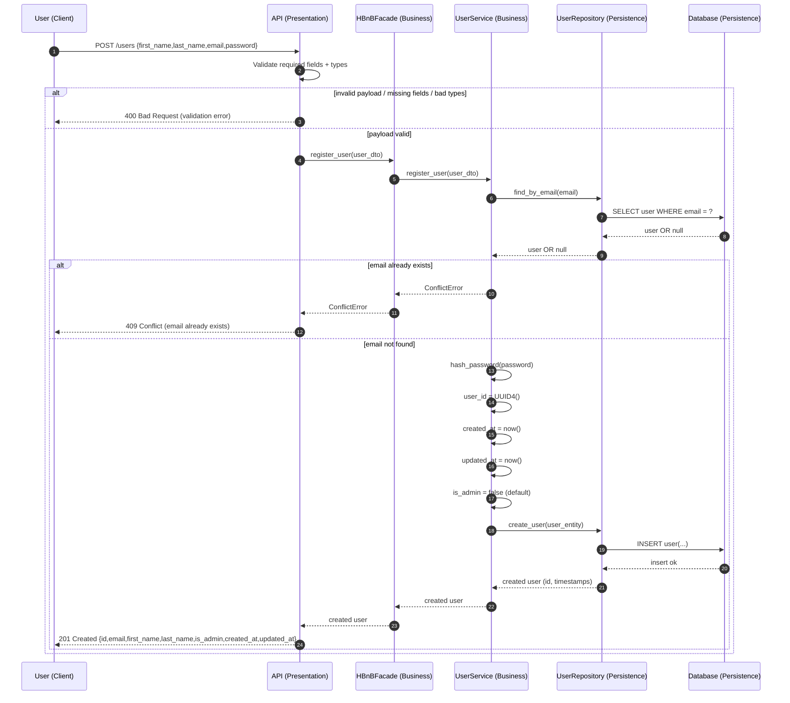
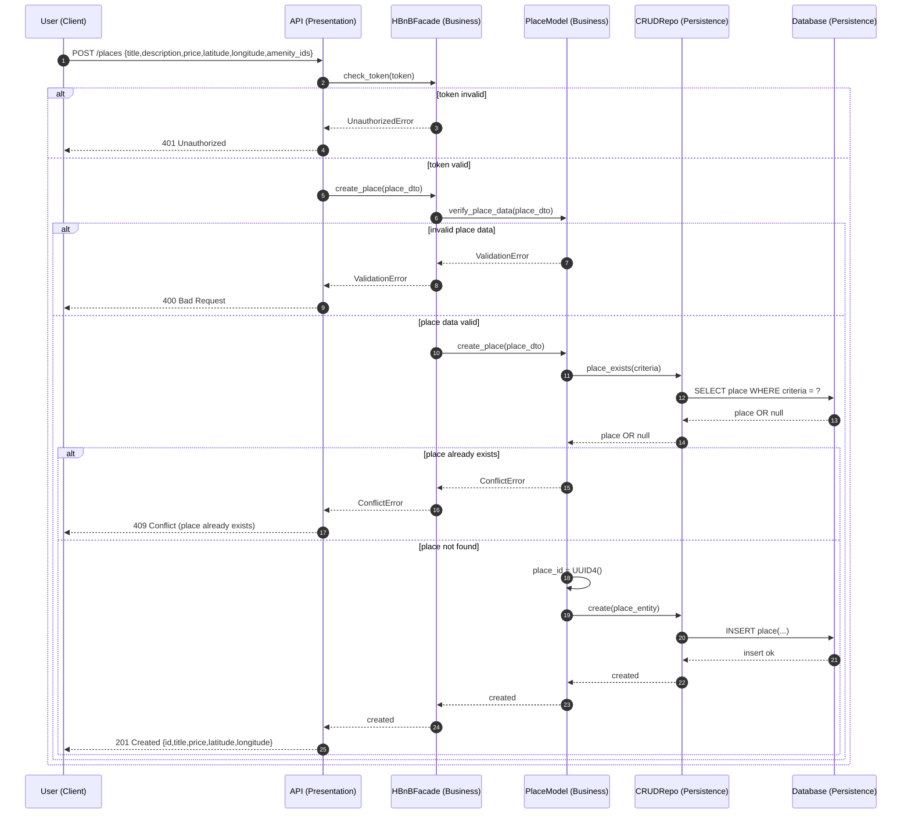
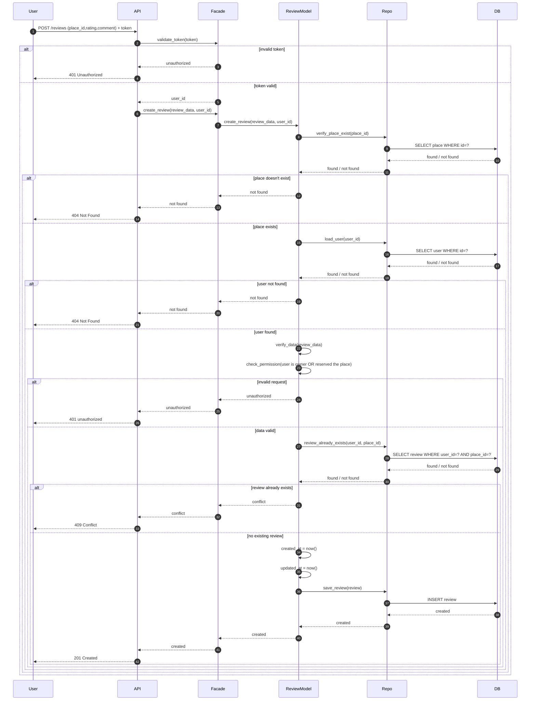
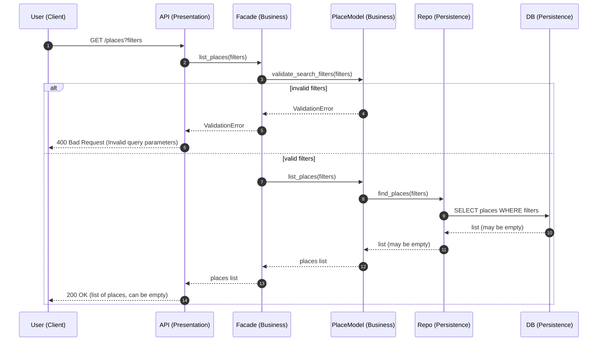

# **HBnB Evolution - Technical Design Documentation**

**Project:** HBnB Evolution Application

**Authors:** Nicolas DA SILVA, Joshua BURLE, Alexandre GUILLAMON
________________________________________
## **1. Introduction**

### **1.1 Project Overview**

HBnB Evolution is a simplified AirBnB-like web application that enables users to manage property rentals. The platform allows users to register, list properties (places), leave reviews, and manage amenities.

### **1.2 Purpose of This Document**

This technical documentation serves as the architectural blueprint for the HBnB Evolution project. It details the system architecture, business logic design, and API interaction flows to guide the implementation phases.

### **1.3 Document Scope**

This document includes:
- High-level architecture with three-layer design
- Detailed class diagrams for business entities
- Sequence diagrams illustrating API interactions
- Business rules and design decisions
________________________________________
## **2. High-Level Architecture**

### **2.1 Layered Architecture Pattern**

The HBnB application follows a three-layer architecture that separates concerns and improves maintainability:

**Presentation Layer (API & Services)**
- Handles HTTP requests and responses
- Manages API endpoints for User, Place, Review, and Amenity
- Performs input validation and authentication
- Formats responses in JSON

**Business Logic Layer (Models)**
- Contains core business logic and models
- Implements the Facade pattern as central interface
- Manages entity relationships and validation
- Enforces business rules

**Persistence Layer (Database)**
- Handles data storage and retrieval
- Implements Repository pattern for data access
- Manages database operations and transactions
- Abstracts database from business logic

### **2.2 Package Diagram**

**Diagram Explanation:**
- Dotted arrows (..>) represent dependency relationships, showing that one layer uses services from another
- Presentation Layer depends on Business Logic via the Facade pattern
- Business Logic Layer depends on Persistence for data operations
- This separation ensures loose coupling and high cohesion

### **2.3 Facade Pattern**

The Facade pattern serves as a unified interface between the Presentation and Business Logic layers:

**Benefits:**
- Simplifies API layer by providing single entry point
- Reduces coupling between layers
- Centralizes business logic orchestration
- Makes the system easier to maintain and test

**Responsibilities:**
- Coordinates operations across multiple models
- Manages complex workflows (e.g., creating a place with amenities)
- Enforces business rules spanning multiple entities
________________________________________
## **3. Business Logic Layer**

### **3.1 Core Entities**

The Business Logic layer consists of four main entities that inherit from a common BaseModel:
BaseModel - Abstract base class providing:

- id: Unique identifier (UUID)
- created_at: Creation timestamp
- updated_at: Last modification timestamp
- Common methods: save(), delete(), to_dict()

User - Represents platform users Place - Represents rental properties Review - Represents user feedback Amenity - Represents property features

### **3.2 Detailed Class Diagram**

### **3.3 Entity Descriptions**

**User Entity**

Manages user accounts and authentication.

*Key Attributes:*
- email: Unique identifier, validated format
- password: Hashed, never stored in plain text
- is_admin: Boolean flag for administrative privileges

*Key Methods:*
- register(): Creates new user with validation
- authenticate(): Verifies credentials
- validate_email(): Ensures email format and uniqueness

*Business Rules:*
- Email must be unique
- Passwords must be hashed (bcrypt)
- Users cannot review their own places

**Place Entity**

Represents properties available for rental.

*Key Attributes:*
- title, description: Property information
- price: Nightly rate (positive float)
- latitude, longitude: Geographic coordinates
- owner_id: References User who created the listing

*Key Methods:*
- create(): Creates new place listing
- add_amenity(): Associates amenity with place
- get_average_rating(): Calculates average from reviews
- validate_coordinates(): Ensures valid lat/long

*Business Rules:*
- Only owner or admin can update/delete
- Coordinates must be valid (-90 to 90, -180 to 180)
- Price must be positive

**Review Entity**

Captures user feedback on places.

*Key Attributes:*
- rating: Integer from 1 to 5
- comment: Text feedback
- user_id, place_id: Foreign keys

*Key Methods:*
- create(): Submits new review
- validate_rating(): Ensures rating in range 1-5

*Business Rules:*
- One review per user per place
- Rating must be 1-5 inclusive
- Users cannot review their own places

**Amenity Entity**

Represents property features (WiFi, parking, pool, etc.).

*Key Attributes:*
- name: Unique amenity name
- description: Optional details

*Business Rules:*
- Name must be unique
- Only admins can create/update/delete amenities
- Many-to-many relationship with places

### **3.4 Relationships**

*User → Place (One-to-Many)*
- One user owns multiple places
- Cascade delete: Deleting user deletes their places

*User → Review (One-to-Many)*
- One user writes multiple reviews
- Cascade delete: Deleting user deletes their reviews

*Place → Review (One-to-Many)*
- One place has multiple reviews
- Cascade delete: Deleting place deletes its reviews

*Place ↔ Amenity (Many-to-Many)*
- Places can have multiple amenities
- Amenities can belong to multiple places
- Junction table: place_amenities
- No cascade delete on either side
________________________________________
## **4. API Interaction Flow**

### **4.1 User Registration**

**Endpoint:** POST /api/users/register

**Flow Description:** This sequence shows how a new user registers, including email validation, password hashing, and database persistence.

**Key Steps:**
1.	Client sends registration data to API
2.	API validates request format
3.	Facade validates email uniqueness
4.	User model hashes password securely
5.	User model generates UUID and timestamps
6.	Repository persists user to database
7.	API returns success with user ID

**Design Decisions:**
- Password hashing happens in Business Logic layer for security
- Email validation occurs before database interaction to fail fast
- UUID generation ensures globally unique identifiers
________________________________________
### **4.2 Place Creation**

**Endpoint:** POST /api/places

**Flow Description:** Authenticated users create property listings. The process includes authentication, coordinate validation, and amenity linking.

**Key Steps:**
1.	Client sends place data with auth token
2.	Authentication layer verifies token and extracts user_id
3.	Facade validates geographic coordinates
4.	Place model creates place and sets owner
5.	Repository persists place to database
6.	Loop through amenities and create associations
7.	API returns success with place ID

**Design Decisions:**
- Authentication happens early to reject unauthorized requests quickly
- Coordinate validation prevents invalid geographic data
- Amenity linking uses many-to-many junction table
- Owner is automatically set from authenticated user
________________________________________
### **4.3 Review Submission**

**Endpoint:** POST /api/places/{place_id}/reviews

**Flow Description:** Users submit reviews for places. Includes validation to prevent duplicate reviews and ensure rating validity.

**Key Steps:**
1.	Client submits review with authentication
2.	Facade verifies place exists
3.	Review model validates rating (1-5)
4.	Check for duplicate review from same user
5.	Create and persist review
6.	Update place's average rating
7.	Return success response

**Design Decisions:**
- Place existence check prevents reviews for non-existent places
- Duplicate check enforces one-review-per-user-per-place rule
- Average rating update keeps place statistics current
- Rating validation ensures data integrity
________________________________________
### **4.4 Fetching List of Places**

**Endpoint:** GET /api/places

**Flow Description:** Retrieves filtered list of places with their amenities and ratings. Supports price and amenity filters.

**Key Steps:**
1.	Client requests places with optional filters
2.	API parses query parameters
3.	Facade builds database query criteria
4.	Repository retrieves matching places
5.	For each place, load amenities and rating
6.	Filter places by amenity requirements
7.	Sort results and return to client

**Design Decisions:**
- Query building happens in Business Logic for flexibility
- Amenities loaded separately to avoid complex joins
- Average ratings calculated on-the-fly (can be cached later)
- Filtering logic centralized in Facade
________________________________________
## **5. Business Rules Summary**

### **5.1 Data Validation**

**User:**
- Email must be unique and valid format
- Password minimum 8 characters, must be hashed
- Names: 1-50 characters

**Place:**
- Title: 3-100 characters
- Price must be positive
- Coordinates: latitude (-90 to 90), longitude (-180 to 180)

**Review:**
- Rating: integer 1-5 only
- Comment: 10-500 characters
- One review per user per place

**Amenity:**
- Name must be unique, 2-50 characters

### **5.2 Authorization**

**Regular Users:**
- Manage own profile, places, and reviews
- View all public content
- Cannot modify others' content

**Administrators:**
- All regular user permissions
- Create/update/delete amenities
- Modify any content
- Delete user accounts

### **5.3 Data Integrity**

**Cascade Deletes:**
- Delete User → Delete their Places and Reviews
- Delete Place → Delete its Reviews

**Referential Integrity:**
- Review must reference valid User and Place
- Place must reference valid User (owner)
- Place-Amenity associations use junction table
________________________________________
## **6. Conclusion**

This technical documentation provides a complete architectural blueprint for the HBnB Evolution application. The three-layer architecture with Facade pattern ensures:
- **Maintainability:** Clear separation of concerns
- **Scalability:** Easy to extend with new features
- **Testability:** Each layer can be tested independently
- **Flexibility:** Database and API can be swapped easily

The diagrams and specifications serve as the foundation for implementation in the future parts of this project.